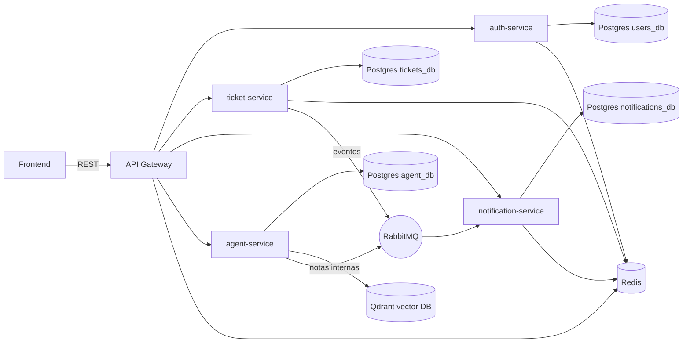

# TicketFlow-Backend
Proyecto Final de Sistemas Distribuidos (Backend)

## Descripción


## Instalación y Ejecución


## Arquitectura del sistema

TicketFlow se implementa como una arquitectura de microservicios con base de datos por servicio. El acceso de clientes se centraliza en un API Gateway y la comunicación entre servicios se realiza vía REST y eventos asíncronos con RabbitMQ.

**Componentes principales**
- **API Gateway:** punto de entrada único para el frontend; enruta solicitudes a los servicios internos y aplica middleware (auth, rate limit, request id).
- **auth-service:** gestión de usuarios y autenticación.
- **ticket-service:** gestión del ciclo de vida de tickets y publicaciones de eventos.
- **notification-service:** consumo de eventos y envío de notificaciones in-app y correo.
- **agent-service (TICBot):** asistencia inteligente, notas internas y búsqueda semántica en Qdrant.

**Persistencia y mensajería**
- **PostgreSQL** por servicio (aislamiento de datos).
- **Redis** compartido para cache, rate limiting y deduplicación de notificaciones.
- **RabbitMQ** para eventos de ticket y notas de agente.
- **Qdrant** como base vectorial para embeddings del agente.

**Estructura de archivos (resumen)**
```
TicketFlow-Backend/
|-- docker-compose.yml
|-- README.md
|-- LICENSE
|-- docs/
|   |-- DATA_MODEL.md
|   `-- EVENT_CATALOG.md
|-- api-gateway/
|   |-- Dockerfile
|   |-- requirements.txt
|   `-- app/
|       |-- __init__.py
|       |-- main.py
|       |-- rabbit.py
|       |-- core/
|       |   |-- __init__.py
|       |   |-- auth.py
|       |   |-- config.py
|       |   |-- http_client.py
|       |   |-- proxy.py
|       |   `-- redis_client.py
|       |-- middleware/
|       |   |-- __init__.py
|       |   |-- rate_limit.py
|       |   `-- request_id.py
|       `-- routers/
|           |-- __init__.py
|           |-- agent.py
|           |-- auth.py
|           |-- notifications.py
|           `-- tickets.py
|-- auth-service/
|   |-- Dockerfile
|   |-- requirements.txt
|   |-- seed.py
|   `-- app/
|       |-- __init__.py
|       |-- main.py
|       |-- core/
|       |   |-- __init__.py
|       |   |-- config.py
|       |   |-- redis_client.py
|       |   `-- security.py
|       |-- db/
|       |   |-- __init__.py
|       |   `-- database.py
|       |-- models/
|       |   |-- __init__.py
|       |   `-- user.py
|       |-- routers/
|       |   |-- __init__.py
|       |   |-- auth.py
|       |   `-- users.py
|       `-- schemas/
|           |-- __init__.py
|           `-- user.py
|-- ticket-service/
|   |-- Dockerfile
|   |-- requirements.txt
|   `-- app/
|       |-- __init__.py
|       |-- main.py
|       |-- core/
|       |   |-- __init__.py
|       |   |-- auth.py
|       |   |-- config.py
|       |   `-- redis_client.py
|       |-- db/
|       |   |-- __init__.py
|       |   `-- database.py
|       |-- models/
|       |   |-- __init__.py
|       |   `-- ticket.py
|       |-- rabbit/
|       |   `-- publisher.py
|       |-- routers/
|       |   |-- __init__.py
|       |   `-- tickets.py
|       `-- schemas/
|           |-- __init__.py
|           `-- ticket.py
|-- notification-service/
|   |-- Dockerfile
|   |-- requirements.txt
|   `-- app/
|       |-- __init__.py
|       |-- consumer.py
|       |-- main.py
|       |-- core/
|       |   |-- __init__.py
|       |   |-- config.py
|       |   |-- emailjs.py
|       |   |-- redis_client.py
|       |   `-- security.py
|       |-- db/
|       |   |-- __init__.py
|       |   `-- database.py
|       |-- models/
|       |   |-- __init__.py
|       |   `-- notification.py
|       |-- routers/
|       |   |-- __init__.py
|       |   `-- notifications.py
|       `-- schemas/
|           |-- __init__.py
|           `-- notification.py
|-- agent-service/
|   |-- Dockerfile
|   |-- requirements.txt
|   |-- seed.py
|   `-- app/
|       |-- __init__.py
|       |-- main.py
|       |-- agent/
|       |   |-- __init__.py
|       |   |-- admin_tools.py
|       |   |-- embeddings.py
|       |   |-- graph.py
|       |   |-- knowledge.py
|       |   |-- llm.py
|       |   |-- memory.py
|       |   |-- prompts.py
|       |   `-- tools.py
|       |-- core/
|       |   |-- __init__.py
|       |   |-- auth.py
|       |   `-- config.py
|       |-- db/
|       |   |-- __init__.py
|       |   |-- database.py
|       |   `-- vector_db.py
|       |-- models/
|       |   |-- __init__.py
|       |   `-- agent.py
|       |-- routers/
|       |   |-- __init__.py
|       |   |-- admin.py
|       |   |-- categorize.py
|       |   |-- interact.py
|       |   |-- knowledge.py
|       |   |-- memory.py
|       |   |-- notes.py
|       |   `-- qa.py
|       `-- schemas/
|           |-- __init__.py
|           `-- agent.py
```



**Flujos clave**
- El frontend consume el API Gateway; este enruta a `auth-service`, `ticket-service`, `notification-service` y `agent-service`.
- `ticket-service` publica eventos en RabbitMQ (creación, actualización, SLA, replies). `notification-service` consume y persiste notificaciones, y envía correo cuando corresponde.
- `agent-service` consulta tickets, genera notas internas y utiliza Qdrant para búsquedas semánticas.


## Equipo de Desarrollo
- **Iñigo Quintana Delgadillo** - [Inigo1405](https://github.com/Inigo1405)
- **Pablo Urbina Macip** - [Puma120](https://github.com/Puma120)
- **David André Acosta Avila** - [spygon9](https://github.com/spygon9)
- **Marco Uriel Castañeda Avila** - [Marco0812](https://github.com/Marco0812)
